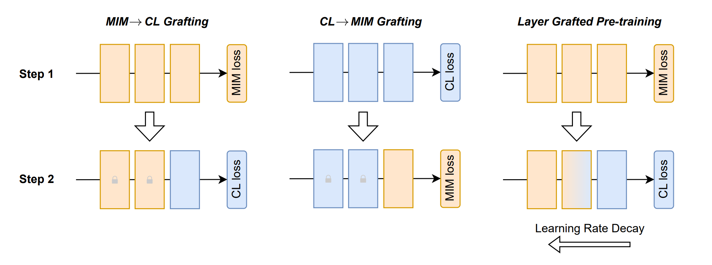

<head>
    <link href="../css_files_about/bootstrap.min.css" rel="stylesheet">
    <link href="../css_files_about/css" rel="stylesheet">
    <link href="../css_files_about/my.css" rel="stylesheet">
    <link href="../css_files_about/fontawesome.css" rel="stylesheet">
    <link href="../css_files_about/solid.css" rel="stylesheet">
    <link href="../css_files_about/brands.css" rel="stylesheet">
    <link href="../css_files_about/style.css" rel="stylesheet">
    <link href="../css_files_about/font.css" rel="stylesheet">
</head>

About Me
-----------
I am a researcher at NEC America Lab. Previously, I was a Ph.D. student at Texas A&M University supervised by Prof. Zhangyang Wang. My research interests lie in Self-Supervised (SS) Learning, Efficient Training, Indoor Scene Occlusion Reasoning, etc. His works are published at various top conferences such as NeurIPS, ICML, ICLR, CVPR, and ECCV. 

Selected Publications
------------

    

        

            

                

                    

                        

                                <video width="18%" autoplay loop muted playsinline>
                                    <source src="../images/gifs/HorizonForge.mp4" type="video/mp4">
                                </video>
                        

                    

                    

                        

                            <a>
                                HorizonForge: Driving Scene Editing with Any Trajectories and Any Vehicles
                            </a>
                        

                        

                            Yifan Wang, Francesco Pittaluga, Zaid Tasneem, Chenyu You, Manmohan Chandraker, <me>Ziyu Jiang</me>†
                        

                        
<a style="font-size: 14px; font-weight: bold"><i>CVPR 2026</i></a>

                        <a style="font-size: 14px" href="https://horizonforge.github.io/">[Project Page]</a>
                    

                

            

            

                

                    

                        

                                
                        

                    

                    

                        

                            <a>
                                PhyCo: Learning Controllable Physical Priors for Generative Motion
                            </a>
                        

                        

                            Sriram Narayanan, <me>Ziyu Jiang</me>, Srinivasa Narasimhan, Manmohan Chandraker
                        

                        
<a style="font-size: 14px; font-weight: bold"><i>CVPR 2026</i></a>

                    

                

            

            

                

                    

                        

                                <video width="18%" autoplay loop muted playsinline>
                                    <source src="../images/gifs/autoscape_iccv2025.mp4" type="video/mp4">
                                </video>
                        

                    

                    

                        

                            <a>
                                AutoScape: Geometry-Consistent Long-Horizon Scene Generation
                            </a>
                        

                        

                            Jiacheng Chen*, <me>Ziyu Jiang</me>*†, Mingfu Liang, Bingbing Zhuang, Jong-Chyi Su, Sparsh Garg, Ying Wu, Manmohan Chandraker
                        

                        
<a style="font-size: 14px; font-weight: bold"><i>ICCV 2025</i></a>

                        <a style="font-size: 14px" href="https://jcchen.me/autoscape_page/">[Project Page]</a>
                    

                

            

            

                

                    

                        

                                
                        

                    

                    

                        

                            <a>
                                LidaRF: Delving into Lidar for Neural Radiance Field on Street Scenes
                            </a>
                        

                        

                            Shanlin Sun, Bingbing Zhuang, <me>Ziyu Jiang</me>, Buyu Liu, Xiaohui Xie, Manmohan Chandraker
                        

                        
<a style="font-size: 14px; font-weight: bold"><i>CVPR 2024</i></a>

                        <a style="font-size: 14px" href="https://siwensun.github.io/lidarf-project/">[Project Page]</a>
                    

                

            

            

                

                    

                        

                                
                        

                    

                    

                        

                            <a>
                                Layer Grafted Pre-training: Bridging Contrastive Learning And Masked Image Modeling For Better Representations
                            </a>
                        

                        

                            <me>Ziyu Jiang</me>, Yinpeng Chen, Mengchen Liu, Dongdong Chen, Xiyang Dai, Lu Yuan, Zicheng Liu, Zhangyang Wang
                        

                        
<a style="font-size: 14px; font-weight: bold"><i>ICLR 2023</i></a>

                        <a style="font-size: 14px" href="https://openreview.net/forum?id=jwdqNwyREyh">[Paper]</a>
                        <a style="font-size: 14px" href="https://github.com/VITA-Group/layerGraftedPretraining_ICLR23">[Code]</a>
                    

                

            

            

                

                    

                        

                                
                        

                    

                    

                        

                            <a>
                                Back Razor: Memory-Efficient Transfer Learning by Self-Sparsified Backpropogation 
                            </a>
                        

                        

                            <me>Ziyu Jiang*</me>, Xuxi Chen*, Xueqin Huang, Xianzhi Du, Denny Zhou, Zhangyang Wang
                        

                        
<a style="font-size: 14px; font-weight: bold"><i>Neurips 2022</i></a>

                        <a style="font-size: 14px" href="https://openreview.net/forum?id=mTXQIpXPDbh">[Paper]</a>
                        <a style="font-size: 14px" href="https://github.com/VITA-Group/BackRazor_Neurips22">[Code]</a>
                    

                

            

            

                

                    

                        

                                
                        

                    

                    

                        

                            <a>
                                DnA: Improving Few-shot Transfer Learning with Low-Rank Decomposition and Alignment 
                            </a>
                        

                        

                            <me>Ziyu Jiang</me>, Tianlong Chen, Xuxi Chen, Yu Cheng, Luowei Zhou, Lu Yuan, Ahmed Awadallah, Zhangyang Wang
                        

                        
<a style="font-size: 14px; font-weight: bold"><i>ECCV 2022</i></a>

                        <a style="font-size: 14px" href="https://www.ecva.net/papers/eccv_2022/papers_ECCV/papers/136800229.pdf">[Paper]</a>
                        <a style="font-size: 14px" href="https://github.com/VITA-Group/DnA">[Code]</a>
                    

                

            

            

                

                    

                        

                                
                        

                    

                    

                        

                            <a>
                                Improving Contrastive Learning onImbalanced Data via Open-World Sampling 
                            </a>
                        

                        

                            <me>Ziyu Jiang</me>, Tianlong Chen, Ting Chen, Zhangyang Wang
                        

                        
<a style="font-size: 14px; font-weight: bold"><i>Neurips 2021</i></a>

                        <a style="font-size: 14px" href="https://proceedings.neurips.cc/paper/2021/file/2f37d10131f2a483a8dd005b3d14b0d9-Paper.pdf">[Paper]</a>
                        <a style="font-size: 14px" href="https://github.com/VITA-Group/MAK">[Code]</a>
                    

                

            

            

                

                    

                        

                                
                        

                    

                    

                        

                            <a>
                                Self-Damaging Contrastive Learning 
                            </a>
                        

                        

                            <me>Ziyu Jiang</me>, Tianlong Chen, Bobak Mortazavi, Zhangyang Wang
                        

                        
<a style="font-size: 14px; font-weight: bold"><i>ICML 2021</i></a>

                        <a style="font-size: 14px" href="https://arxiv.org/abs/2106.02990">[Paper]</a>
                        <a style="font-size: 14px" href="https://github.com/VITA-Group/SDCLR">[Code]</a>
                    

                

            

            

                

                    

                        

                                
                        

                    

                    

                        

                            <a>
                                Robust Pre-Training by Adversarial Contrastive Learning 
                            </a>
                        

                        

                            <me>Ziyu Jiang</me>, Tianlong Chen, Ting Chen, Zhangyang Wang
                        

                        
<a style="font-size: 14px; font-weight: bold"><i>Neurips 2020</i></a>

                        <a style="font-size: 14px" href="https://proceedings.neurips.cc/paper/2020/file/ba7e36c43aff315c00ec2b8625e3b719-Paper.pdf">[Paper]</a>
                        <a style="font-size: 14px" href="https://github.com/VITA-Group/Adversarial-Contrastive-Learning">[Code]</a>
                    

                

            

            

                

                    

                        

                                
                        

                    

                    

                        

                            <a>
                                Peek-a-Boo: Occlusion Reasoning in Indoor Scenes With Plane Representations 
                            </a>
                        

                        

                            <me>Ziyu Jiang</me>, Buyu Liu, Samuel Schulter, Zhangyang Wang, Manmohan Chandraker
                        

                        
<a style="font-size: 14px; font-weight: bold"><i>CVPR 2020 (ORAL)</i></a>

                        <a style="font-size: 14px" href="https://openaccess.thecvf.com/content_CVPR_2020/papers/Jiang_Peek-a-Boo_Occlusion_Reasoning_in_Indoor_Scenes_With_Plane_Representations_CVPR_2020_paper.pdf">[Paper]</a>
                        <a style="font-size: 14px" href="https://www.nec-labs.com/research/media-analytics/projects/peek-a-boo-occlusion-reasoning-in-indoor-scenes-with-plane-representations/">[Project Page]</a>
                    

                

            

            

                

                    

                        

                                
                        

                    

                    

                        

                            <a>
                                E2-Train: Training State-of-the-art CNNs with Over 80% Less Energy
                            </a>
                        

                        

                            Yue Wang*, <me>Ziyu Jiang*</me>, Xiaohan Chen*, Pengfei Xu, Yang Zhao, Yingyan Lin, Zhangyang Wang
                        

                        
<a style="font-size: 14px; font-weight: bold"><i>Neurips 2019</i></a>

                        <a style="font-size: 14px" href="https://proceedings.neurips.cc/paper/2019/file/663772ea088360f95bac3dc7ffb841be-Paper.pdf">[Paper]</a>
                        <a style="font-size: 14px" href="https://github.com/GATECH-EIC/E2Train">[Code]</a>
                    

                

            

            

                

                    

                        

                                
                        

                    

                    

                        

                            <a>
                                Collaborative Global-Local Networks for Memory-Efficient Segmentation of Ultra-High Resolution Images
                            </a>
                        

                        

                            Wuyang Chen*, <me>Ziyu Jiang*</me>, Zhangyang Wang, Kexin Cui, Xiaoning Qian
                        

                        
<a style="font-size: 14px; font-weight: bold"><i>CVPR 2019 (ORAL)</i></a>

                        <a style="font-size: 14px" href="https://openaccess.thecvf.com/content_CVPR_2019/papers/Chen_Collaborative_Global-Local_Networks_for_Memory-Efficient_Segmentation_of_Ultra-High_Resolution_Images_CVPR_2019_paper.pdf">[Paper]</a>
                        <a style="font-size: 14px" href="https://github.com/VITA-Group/GLNet">[Code]</a>
                    

                

            

        

    

Professional Experience
-----------
May - August, 2022
:   **Research Intern**, *Microsoft*, Redmond, WA

      Mentors:  Yinpeng Chen 
      *Research on self-supervised pre-training* 
      <ul><li style="margin-top: -1rem">Explore self-supervised methods that can combine the benefits of both Mask Image Modeling (MIM) and Contrastive Learning (CL).</li></ul>

May - August, 2021
:   **Research Intern**, *Microsoft*, Redmond, WA

      Mentors:  Luowei Zhou, Yu Cheng 
      *Research on self-supervised transfer learning* 
      <ul><li style="margin-top: -1rem">Explore self-supervised methods with better few-shot performance via improving both pre-training and fine-tuning.</li></ul>

June - November, 2020
:   **Research Intern**, *Bytedance AI Lab*, Mountain View, CA

      Mentors:  Linjie Yang 
      *Research on video segmentation* 
      <ul><li style="margin-top: -1rem">Explore efficient approach for video segmentation.</li></ul>

June - August, 2019
:   **Research Intern**, *NEC laboratories america inc*, San. Jose, CA

      Mentors:  Buyu, Liu 
      *Research on indoor scene understanding* 
      <ul><li style="margin-top: -1rem">Explore better algorithms for semantic segmenation of indoor scene.</li></ul>

